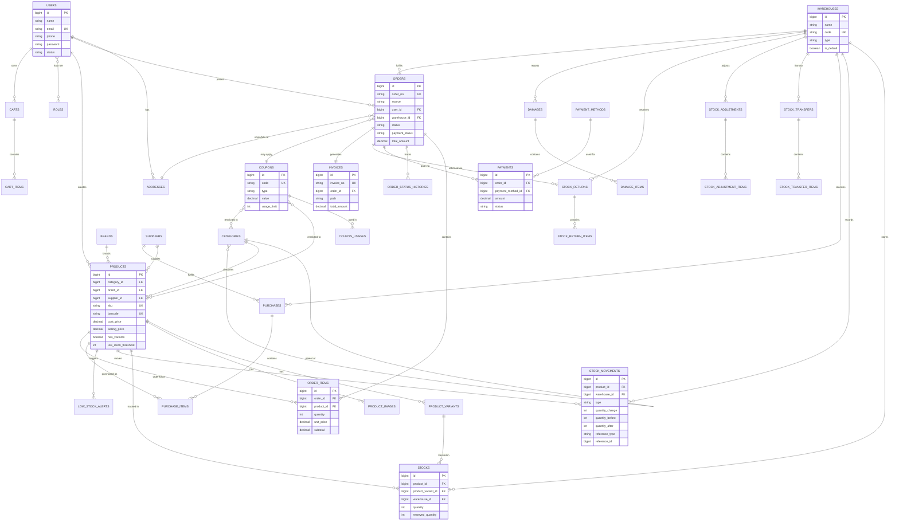
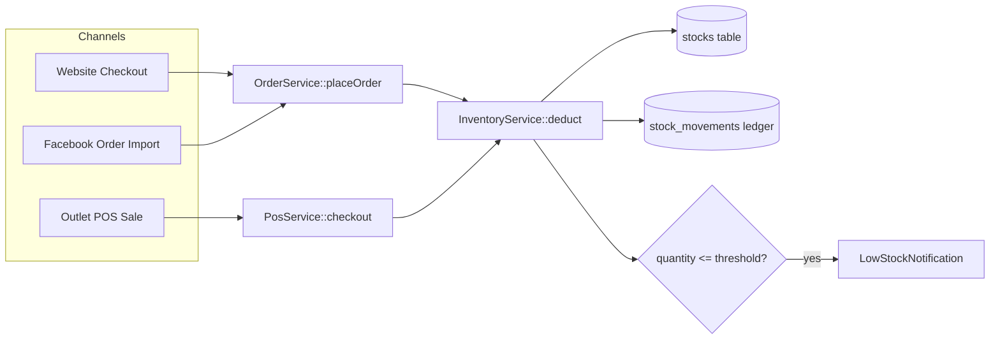

# Royal SL E-commerce — Entity Relationship Diagram

```mermaid
erDiagram
    USERS ||--o{ ADDRESSES : has
    USERS ||--o{ ORDERS : places
    USERS ||--o{ PRODUCTS : creates
    USERS }o--o{ ROLES : "has role"

    CATEGORIES ||--o{ CATEGORIES : "parent of"
    CATEGORIES ||--o{ PRODUCTS : classifies
    BRANDS ||--o{ PRODUCTS : brands
    SUPPLIERS ||--o{ PRODUCTS : supplies
    SUPPLIERS ||--o{ PURCHASES : "fulfills"

    PRODUCTS ||--o{ PRODUCT_VARIANTS : has
    PRODUCTS ||--o{ PRODUCT_IMAGES : has
    PRODUCTS ||--o{ STOCKS : "tracked in"
    PRODUCT_VARIANTS ||--o{ STOCKS : "tracked in"

    WAREHOUSES ||--o{ STOCKS : stores
    WAREHOUSES ||--o{ STOCK_MOVEMENTS : records
    WAREHOUSES ||--o{ PURCHASES : receives
    WAREHOUSES ||--o{ STOCK_TRANSFERS : "from/to"
    WAREHOUSES ||--o{ STOCK_ADJUSTMENTS : adjusts
    WAREHOUSES ||--o{ STOCK_RETURNS : receives
    WAREHOUSES ||--o{ DAMAGES : reports
    WAREHOUSES ||--o{ ORDERS : fulfills

    PRODUCTS ||--o{ STOCK_MOVEMENTS : moves
    PRODUCTS ||--o{ LOW_STOCK_ALERTS : triggers

    PURCHASES ||--o{ PURCHASE_ITEMS : contains
    PRODUCTS ||--o{ PURCHASE_ITEMS : "purchased as"

    STOCK_TRANSFERS ||--o{ STOCK_TRANSFER_ITEMS : contains
    STOCK_ADJUSTMENTS ||--o{ STOCK_ADJUSTMENT_ITEMS : contains
    STOCK_RETURNS ||--o{ STOCK_RETURN_ITEMS : contains
    DAMAGES ||--o{ DAMAGE_ITEMS : contains

    ORDERS ||--o{ ORDER_ITEMS : contains
    ORDERS ||--o{ ORDER_STATUS_HISTORIES : tracks
    ORDERS ||--o{ PAYMENTS : "paid via"
    ORDERS ||--o{ STOCK_RETURNS : "returned via"
    ORDERS ||--|| INVOICES : generates
    ORDERS }o--|| COUPONS : "may apply"
    ORDERS }o--|| ADDRESSES : "ships/bills to"
    PRODUCTS ||--o{ ORDER_ITEMS : "ordered as"

    CARTS ||--o{ CART_ITEMS : contains
    USERS ||--o{ CARTS : owns

    PAYMENT_METHODS ||--o{ PAYMENTS : "used for"

    COUPONS ||--o{ COUPON_USAGES : "used in"
    COUPONS }o--o{ PRODUCTS : "restricted to"
    COUPONS }o--o{ CATEGORIES : "restricted to"

    USERS {
        bigint id PK
        string name
        string email UK
        string phone
        string password
        string status
    }
    PRODUCTS {
        bigint id PK
        bigint category_id FK
        bigint brand_id FK
        bigint supplier_id FK
        string sku UK
        string barcode UK
        decimal cost_price
        decimal selling_price
        boolean has_variants
        int low_stock_threshold
    }
    STOCKS {
        bigint id PK
        bigint product_id FK
        bigint product_variant_id FK
        bigint warehouse_id FK
        int quantity
        int reserved_quantity
    }
    STOCK_MOVEMENTS {
        bigint id PK
        bigint product_id FK
        bigint warehouse_id FK
        string type
        int quantity_change
        int quantity_before
        int quantity_after
        string reference_type
        bigint reference_id
    }
    ORDERS {
        bigint id PK
        string order_no UK
        string source
        bigint user_id FK
        bigint warehouse_id FK
        string status
        string payment_status
        decimal total_amount
    }
    ORDER_ITEMS {
        bigint id PK
        bigint order_id FK
        bigint product_id FK
        int quantity
        decimal unit_price
        decimal subtotal
    }
    PAYMENTS {
        bigint id PK
        bigint order_id FK
        bigint payment_method_id FK
        decimal amount
        string status
    }
    COUPONS {
        bigint id PK
        string code UK
        string type
        decimal value
        int usage_limit
    }
    WAREHOUSES {
        bigint id PK
        string name
        string code UK
        string type
        boolean is_default
    }
    INVOICES {
        bigint id PK
        string invoice_no UK
        bigint order_id FK
        string path
        decimal total_amount
    }
```

## Order flow across channels (all reduce the same inventory)

```mermaid
flowchart LR
    subgraph Channels
        W[Website Checkout]
        F[Facebook Order Import]
        P[Outlet POS Sale]
    end

    W --> OS[OrderService::placeOrder]
    F --> OS
    P --> PS[PosService::checkout]

    OS --> INV[InventoryService::deduct]
    PS --> INV

    INV --> STK[(stocks table)]
    INV --> MOV[(stock_movements ledger)]
    INV --> ALERT{quantity <= threshold?}
    ALERT -->|yes| NOTIFY[LowStockNotification]
```
